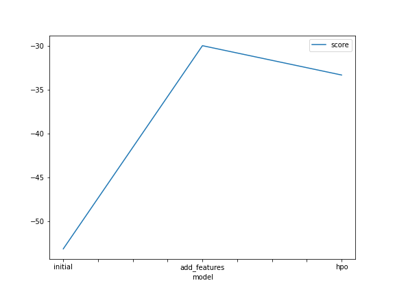
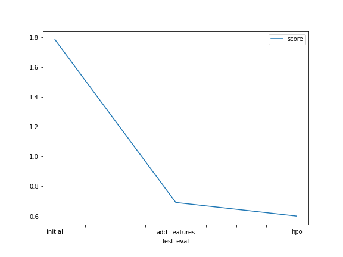

# Report: Predict Bike Sharing Demand with AutoGluon Solution
### Philippe Jean Mith

## Initial Training
### What did you realize when you tried to submit your predictions? What changes were needed to the output of the predictor to submit your results?

When i did my first submission i realize that the performance of the model was really poor. I did not do any change to submit the the first result.

### What was the top ranked model that performed?
The top ranked model that performed was the WeightedEnsemble_L3 where we used the data with created features.

## Exploratory data analysis and feature creation
### What did the exploratory analysis find and how did you add additional features?
Since the datetime feature was already in datetime type, i extracted year, month, day and hour into separate features from the datetime feature and i also converted the type of the features season, holiday, workingday and weather into category type.

### How much better did your model preform after adding additional features and why do you think that is?
After adding the four new features the model grow up from `1.79022` `to 0.69275`. We know that Feature engineering is useful to create a robust dataset and increase the effectiveness of a model.

## Hyper parameter tuning
### How much better did your model preform after trying different hyper parameters?
In my case with the hyperparameters the performance drop down to `0.48534` using `GBM` and `NN_TORCH` with a `num_trials` equal to 5. After difference try i add the `XGB` and a `num_trials` equal to 3 the performance grow up to `0.60173`.

### If you were given more time with this dataset, where do you think you would spend more time?
I would spend more time on exploratory data analysis and also try more hyperparameters.

### Create a line plot showing the top model score for the three (or more) training runs during the project.

### Create a line plot showing the top kaggle score for the three (or more) prediction submissions during the project.

## Summary
in this project I was able to apply all the concepts that were covered in this unit of the course, by using this skills I was able to develop a machine learning regression model by using the autogluon framework, at the end the results were good because the kaggle score of my model was close to the professional developers with years of experince.

 In this project i was able to build a regression model to predict the bike demand given the bike sharing historical data. I first load the data and analyzed the features, plotting sample rows and using pandas describe method to view some of the min/max/varition of the dataset features. Then I build the first model with default parameters and without doing much temparing with the features.

For the second model i did a few exploratory data analysis and feature creation
by extracting year, month, day and hour into separate features from the datetime feature and i also converted the type of the features season and weather into category type. Then I trained the model and this significant improved by 68%.

For more experience i used hyperparameters for model algorithm which are GBM,	NN and	XGB. After the training the model was decreased by 60%. I think if we spend more time on explanatory data analysis and use more on tuning the model can get better
